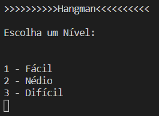
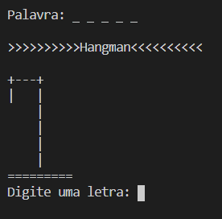

# Solução ao Lab 03 do Curso Python Fundamentos

Data Science Academy - Repositório dos Arquivos do Curso Gratuito Python Fundamentos para Análise de Dados.

https://www.datascienceacademy.com.br

## Imagens das Telas

  
  &#32;
   

